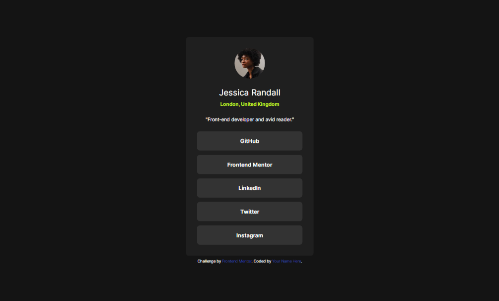

# Frontend Mentor - Social links profile solution

This is a solution to the [Social links profile challenge on Frontend Mentor](https://www.frontendmentor.io/challenges/social-links-profile-UG32l9m6dQ). Frontend Mentor challenges help you improve your coding skills by building realistic projects. 

## Table of contents

- [Frontend Mentor - Social links profile solution](#frontend-mentor---social-links-profile-solution)
  - [Table of contents](#table-of-contents)
  - [Overview](#overview)
    - [The challenge](#the-challenge)
    - [Screenshot](#screenshot)
    - [Links](#links)
  - [My process](#my-process)
    - [Built with](#built-with)
    - [Useful resources](#useful-resources)
  - [Author](#author)

## Overview

### The challenge

Users should be able to:

- See hover and focus states for all interactive elements on the page

### Screenshot

### Links

- Solution URL: [https://www.frontendmentor.io/solutions/social-links-profile-using-tailwind-css-Mu8ymICv8Q](https://www.frontendmentor.io/solutions/social-links-profile-using-tailwind-css-Mu8ymICv8Q)
- Live Site URL: [https://social-links-profile-brown-six.vercel.app](https://social-links-profile-brown-six.vercel.app/)

## My process

### Built with

- Semantic HTML5 markup
- [Tailwind CSS](https://tailwindcss.com/) - For styles

### Useful resources

- [Tailwind CSS docs](https://tailwindcss.com/docs) - This is the official documentation for Tailwind CSS which provide everything you need from setting up your project to customizing Tailwind CSS 
## Author

- Frontend Mentor - [@ahmadktn](https://www.frontendmentor.io/profile/ahmadktn)
